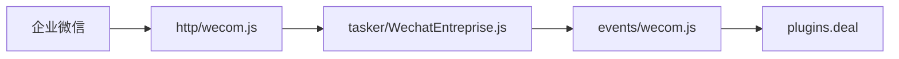

<div align="center">

# 💼 Wechat-entreprise-Core

**企业微信自建应用：服务端接收消息（回调）+ 主动发送应用消息（`message/send`），事件名 `wecom.message` / `wecom.notice`，`e.reply` 走插件。**

[](https://github.com/sunflowermm/XRK-AGT)
[](https://developer.work.weixin.qq.com/document)
[](./)

</div>

---

## 企业微信侧：要准备什么

以下均在 **[企业微信管理后台](https://work.weixin.qq.com/wework_admin/frame)** 完成，需**企业管理员**或有应用管理权限的账号。

| 步骤 | 说明 |
|------|------|
| 1. 企业已开通企业微信 | 无则先注册/认证（以官方流程为准）。 |
| 2. 创建「自建应用」 | **应用管理 → 应用 → 自建 → 创建应用**。创建后得到 **AgentId**；在应用详情页可查看 **Secret**（即接口文档中的 *应用凭证密钥*）。 |
| 3. 获取 **企业 ID（corpid）** | **我的企业 → 企业信息** 中查看企业 ID（文档称 `corpid`）。 |
| 4. 开启「接收消息」 | 进入该自建应用 → **接收消息 → 设置 API 接收**。按官方要求填写 **URL、Token、EncodingAESKey** 三项（见下表）。保存时企业微信会发起 **GET** 校验 URL，通过后回调才生效。 |

官方说明摘要（与后台表单一致）：

- **URL**：企业后台接收推送的地址，支持 `http`/`https`，**建议使用 `https`**。须公网可达，且路径与下文「本服务回调地址」一致。
- **Token**：参与签名，由**英文字母或数字**组成、**长度不超过 32** 的自定义字符串（与 `wecom.yaml` 中 `token` 一致）。
- **EncodingAESKey**：用于消息体加解密，由**英文字母或数字**组成、**长度为 43** 的自定义字符串（与 `wecom.yaml` 中 `encodingAESKey` 一致）。

若服务器前有防火墙，需放行企业微信回调出口 IP，可定期拉取 [企业微信回调 IP 段](https://developer.work.weixin.qq.com/document/path/92521)。

---

## 本服务：`wecom.yaml` 填什么

生效文件：`data/server_bots/{port}/wecom.yaml`（`{port}` 为 XRK HTTP 端口，与 `commonconfig/wecom.js` 中 `ConfigBase` 规则一致）。首次缺失可从 `commonconfig/wecom.default.yaml` 复制。

### 必填（启用后）

| 配置项 | 对应官方概念 | 用途 |
|--------|----------------|------|
| `enabled: true` | — | 开启本 Core 加载与回调路由。 |
| `corpId` | 企业 ID（corpid） | `gettoken`、解密校验等。 |
| `agentId` | 自建应用 AgentId | `message/send` 的 `agentid`。 |
| `agentSecret` 或 `agentSecretFile` | 应用 Secret（corpsecret） | `gettoken` 与调用 `qyapi`。**二选一即可**：直接填 Secret，或填服务器上密钥文件路径。 |
| `token` | 接收消息 Token | 回调 GET/POST **签名校验**。 |
| `encodingAESKey` | 接收消息 EncodingAESKey | 回调消息 **AES 解密**（43 位字符，与后台一致）。 |

以上齐全后，账号才会被判定为「已配置」并注册 `Bot[wecom_*]`；缺任一项会导致无法收消息或无法发消息。

### 回调 URL 怎么填到企业微信后台

本服务注册的 HTTP 路径为：

```text
{callbackPath}/{账号id}
```

默认 `callbackPath: "/wecom/callback"`，单账号且 id 为 `default` 时，完整路径为 `/wecom/callback/default`。

在企业微信「设置 API 接收」里填写的 **URL** 应为（示例）：

```text
https://你的域名/wecom/callback/default
```

若使用多账号，见 `accounts` 中各账号的 id，例如 `/wecom/callback/branch_a`。修改 `callbackPath` 后需**重启** XRK 以重新挂载路由。

### 常用可选

| 配置项 | 说明 |
|--------|------|
| `callbackPath` | 默认 `/wecom/callback`，与 URL 路径前缀一致即可。 |
| `name` | 本端展示名。 |
| `dmPolicy` / `groupPolicy` / `allowFrom` / `groupAllowFrom` | 私聊/群聊是否处理及白名单（见 Tasker 内逻辑）。 |
| `responsePrefix` / `renderMode` | 主动回复内容前缀与 `text`/`markdown` 策略。 |
| `defaultAccount` | 多账号时优先使用的账号 id。 |
| `accounts` | 多企业/多应用：键为账号 id，值为该账号的 `corpId`、`agentSecret` 等（与顶层字段 merge）。 |

Maven 模块与 `internal/` 文件对照见 **`internal/README.md`**。

---

## 事件链路



---

## 代码与目录（概要）

| 路径 | 职责 |
|------|------|
| `commonconfig/wecom.js`、`wecom.default.yaml` | 配置 Schema 与默认模板 |
| `internal/*`、`internal/index.js` | `qyapi`、回调加解密、多账号与回调路径 |
| `shared.js` | `wecom_` 前缀、端口、账号 id 解析 |
| `tasker/WechatEntreprise.js` | 回调验签/解密/派发、`message/send` |
| `http/wecom.js` | 注册 GET/POST，转 Tasker |
| `events/wecom.js` | 挂载 `e.reply` |
| `plugin/` | 业务插件（见 `plugin/README.md`） |

---

## 官方文档（权威）

| 主题 | 链接 |
|------|------|
| 获取 access_token（corpid / corpsecret） | [91039](https://developer.work.weixin.qq.com/document/path/91039) |
| 发送应用消息 | [90236](https://developer.work.weixin.qq.com/document/path/90236) |
| 接收消息与事件（概述） | [90238](https://developer.work.weixin.qq.com/document/path/90238) |
| 回调配置（URL 验证、POST、加解密总述） | [90930](https://developer.work.weixin.qq.com/document/path/90930) |
| 企业微信回调 IP 段 | [92521](https://developer.work.weixin.qq.com/document/path/92521) |

以官方最新文档为准；若后台文案与文档版本不一致，以管理后台实际表单为准。
